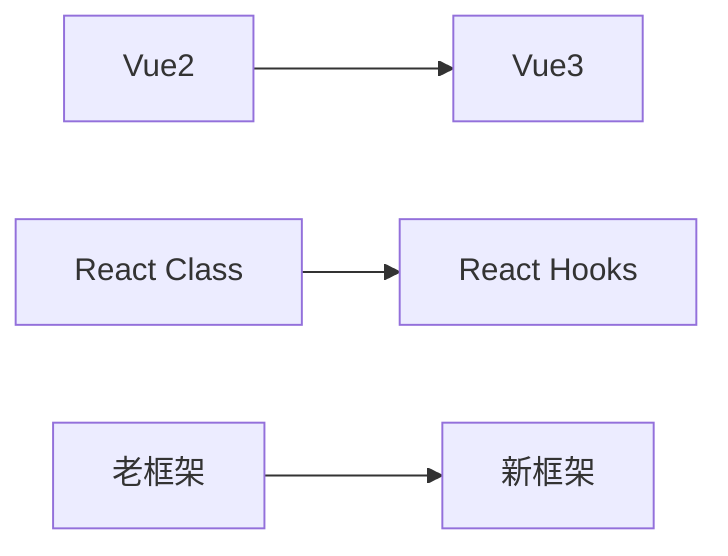

🤔 作为一名工作多年的程序员，回顾过去的职业生涯，发现自己在网上分享的技术文章却寥寥无几。这确实值得深思，今天就来聊聊这个话题。

<!-- truncate -->

## 📌 客观环境的制约

### 🏢 一、996的工作压力

:::tip 真实场景
在互联网公司工作多年，高强度的工作节奏几乎占据了所有的时间和精力。每天早996的工作制度，发版更是要熬到凌晨3-4点，这样的工作强度让人身心俱疲。
:::

记得有一次重大版本上线，连续一周都处于高压状态：
- 🌞 白天要开发新功能
- 🌙 晚上要修复测试反馈的问题
- 🌑 凌晨还要处理线上突发事件

等到周末，整个人都是恍惚的，只想把手机调成静音好好睡一觉。

不仅是我，身边的同事们也都是这样。站会上经常能看到大家顶着黑眼圈，手里捧着第三杯咖啡浓茶在强打精神。下班后的交流基本都是"今天又要加班"、"这个版本xxx号之前要完成，太赶了"之类的感慨。在这样的环境下，能按时吃饭休息就已经很不错了，更别说静下心来写博客。就算偶尔有一些技术心得，也往往因为太疲惫而选择了"改天再写"，然后就被新一轮的工作任务淹没了。

可能有人会说:"996不是还有一天休息时间吗？完全可以利用这一天来写文章啊。"听起来很有道理,但现实往往不那么美好。首先,连续高强度工作后的休息日,很大一部分时间要用来"补觉"，让疲惫的身体恢复元气。等睡到自然醒,往往已经是中午了。

其次,作为独居的打工人,周末必须要处理的生活琐事太多了：洗衣服、打扫房间、采购生活用品、准备下周的餐食...稍不注意,一个下午就这么过去了。更要命的是,很多公司的周一晨会需要汇报上周工作和本周计划。这意味着周日晚上必须要花时间整理一周的工作内容,梳理待办事项,准备汇报材料。

有时候遇到项目进度紧张,周末还会被拉进各种临时会议。主管说"就占用你半小时",结果一讨论就是一两个小时。等处理完这些,已经没有了完整的时间块来进行创作。写技术博客不像写朋友圈,需要连续的时间和清晰的思路,零零碎碎的时间很难产出高质量的内容。

所以表面上看是有一天自由支配的时间,但实际上都被各种"必须要做"的事情切割得支离破碎。等真正能坐下来写作的时候,往往已经是周日晚上,而这时候脑子里想的更多的是"明天又要开始新一轮的996了"。

在这样高压的工作环境下，即使偶尔有写作的冲动，也很难付诸实践。记得有次在加班的地铁上，看到一个技术问题的解决灵感，掏出手机想要记录，却发现思维跟着疲惫的身体变得异常迟钝。敲了几行字就觉得表达不够准确，删了重写，重写再删，最后只能无奈地放弃。这样的情况并非个例，久而久之，不仅是身体上的疲惫，更多的是一种精神上的透支。当每天的工作已经耗尽了所有的创造力，对技术的热情也在这种高强度的工作节奏中被慢慢消磨。从最初的"待会写"、"明天写"，到后来的"算了吧"，分享的念头就这样在疲惫中一次次被搁置，最终变成了一个永远也实现不了的计划。

这种状态就像是一个恶性循环：工作越忙，越没精力写作；不写作，就越发觉得写作是件困难的事；觉得困难，就更容易在疲惫时放弃。最终，不仅消耗了创作的精力，也在不知不觉中磨灭了分享的热情。

### 💻 二、代码的局限性

:::warning 代码分享的困境
很多时候，我们在公司开发的都是内部系统或者商业项目，由于保密协议的限制，这些实战经验无法对外分享。
:::

以下是我们常遇到的问题：

| 问题类型 | 具体表现 |
|---------|---------|
| 保密限制 | 涉及公司核心业务逻辑 |
| 业务耦合 | 代码高度定制化 |
| 环境依赖 | 需要特定的技术栈支持 |
| 版权问题 | 代码仓库私有化 |

比如我曾经参与过一个大型税务平台的系统开发，涉及了很多分布式事务和高并发处理的经验，但因为涉及公司和甲方核心业务逻辑，这些宝贵的经验只能烂在肚子里。

即便是那些不涉及商业机密的代码，其实也面临着分享价值的困境。企业级项目往往是为了解决特定业务场景而开发，代码高度定制化，耦合了太多业务规则。如果直接分享这样的代码，对其他开发者的参考价值是有限的。记得有次我想分享一个税务数据统计模块的实现，但发现剥离业务逻辑后，剩下的代码框架变得索然无味，完全无法体现当初解决问题时的精妙之处。

另外，很多企业都有自己的技术栈和开发框架，这些都是经过二次封装的。比如公司内部的权限管理系统、消息中间件的封装等，都是基于开源框架深度定制的。这些代码放到公司外面，失去了特定的环境支持，根本无法运行，更别说复现问题了。

还有一个现实问题是，大部分公司的代码仓库都是私有的，即使是离职后也要遵守保密协议。想要分享某个技术点，就必须重新写一份示例代码。但工作繁忙的情况下，很少有人愿意花时间去重新实现一个完整的demo。所以，很多有价值的实战经验，最终都因为这样那样的限制，无法转化为有价值的技术分享。

### 📚 三、早期博客平台的局限

在最初接触技术博客时，主流平台还是CSDN。但当时的文档编辑体验并不理想，Markdown支持不完善，这在一定程度上也影响了创作的积极性。记得那时候写一篇技术文章，要在各种富文本编辑器里反复调整格式，代码高亮经常失效，图片上传也特别麻烦，往往花在排版上的时间比写作本身还要多。

更让人困扰的是，这些平台为了商业化运营，经常在文章中插入大量广告，有时甚至会破坏文章的排版。还出现过代码示例被广告分割的情况，严重影响了阅读体验。这种情况不仅让作者觉得自己的作品被不尊重，读者的阅读体验也大打折扣。

除了技术层面的问题，早期的博客平台还存在内容管理的困扰。比如文章的分类、标签系统不够灵活，搜索功能也比较简陋。想要整理一个系列的技术文章，或者建立知识体系，都显得特别困难。而且平台对文章的所有权控制也不够清晰，有时候辛辛苦苦写的文章，却在平台规则变更后面临各种限制。

另外，早期的博客平台社区氛围也不够理想。评论区经常充斥着各种无意义的留言，真正有价值的技术讨论反而很少。这种情况让很多原本想认真写作的开发者失去了动力，毕竟写技术博客的初衷是分享和交流，而不是成为刷流量的工具。

这些平台的局限性，加上之前提到的工作压力和代码限制，让很多开发者在尝试写作后逐渐放弃。直到近几年，随着各种现代化的写作平台和工具出现，这些问题才得到了较好的解决。但那时候，我可能已经错过了养成写作习惯的最佳时期。

## 🧠 个人认知的局限

### 📚 一、知识积累意识薄弱

:::caution 技术更新的误区
年轻时总觉得技术更新太快，今天学的明天就过时了，没有形成持续积累和系统化整理的习惯。
:::

前端技术栈的快速迭代：

而且在工作初期，过分关注解决问题的结果，而忽视了记录解决问题的过程。每次遇到技术难题，都是在 Stack Overflow 上找到答案，复制粘贴解决问题就完事了，很少去深入理解背后的原理，更不用说把这些经验总结成文章了。现在回想起来，如果当时就开始记录，哪怕是简单的问题解决笔记，现在应该已经沉淀了相当丰富的技术资产。

### 🤔 二、对分享价值的认知不足

常常觉得自己的经验和思考"不够高深"，担心写出来的东西"太基础"而没有分享的价值。每次想写文章，都会不自觉地跟那些技术大牛的博客比较：人家写的都是源码分析、架构设计，我这些日常开发的经验是不是太低级了？

这种对"基础内容无价值"的认知偏差，导致总是在等待——等自己技术更精进了再写，等遇到了足够高深的问题再写。却忽略了一个事实：每个开发者都是从基础开始的，我今天觉得简单的知识点，对于更初级的开发者来说可能恰恰就是他们最需要的。而且，写作本身就是一个提升认知的过程，通过把问题讲清楚，往往能发现自己理解中的盲点。

### 🤝 三、缺乏知识输出的反馈循环

没有持续输出，就无法获得读者的反馈，也就无法体会到分享带来的成就感和进步。记得第一次尝试写技术文章，写完后既没人评论，也没人点赞，这种"对牛弹琴"的感觉让人很受打击。而且因为缺乏写作经验，总觉得表达不够准确，生怕写错被人指出，这种担心也在不断消耗写作的动力。

这就形成了一个消极循环：因为没有反馈所以不想写，不写就更得不到反馈。反观那些活跃的技术博主，他们往往是通过持续输出，逐渐积累了固定的读者群，读者的反馈又会激励他们产出更多优质内容。而我，因为始终没有跨过这个起步的门槛，错过了很多和同行交流、共同进步的机会。

## 🌟 重新开始的契机

### 🔄 一、职业转折带来的思考

:::info 转机
这次的失业经历，反而给了我一个难得的喘息机会。离开了高强度的工作环境，终于有时间静下心来，重新审视自己的职业发展。
:::

### 🎯 二、建立个人品牌的重要性

个人品牌建设的优势：
- 📈 提升职业竞争力
- 🤝 扩展人脉网络
- 💡 促进知识沉淀
- 🎁 获取更多机会

### 🌱 三、拥抱新的开始

:::success 行动计划
决定从现在开始认真经营这个技术博客，把过去积累的经验系统地整理出来。
:::

**具体计划**：
1. 📝 项目技术难点复盘
2. 📖 学习心得记录
3. 📚 系统性技术教程
4. 🤝 技术社区交流

> 🌳 种一棵树最好的时间是十年前，其次是现在。

虽然之前错过了很多记录的机会，但现在开始也不晚。这个博客就是我的新起点，希望能够坚持下去，留下一些有价值的内容。通过持续的输出和分享，为自己的技术人生开启一个新的篇章。 